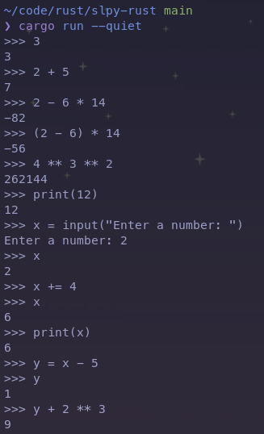
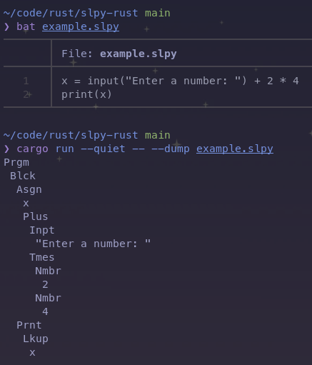
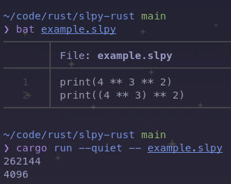
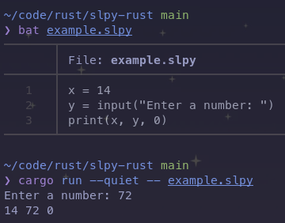
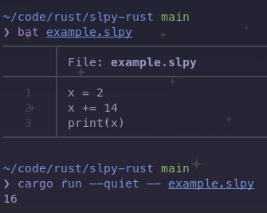
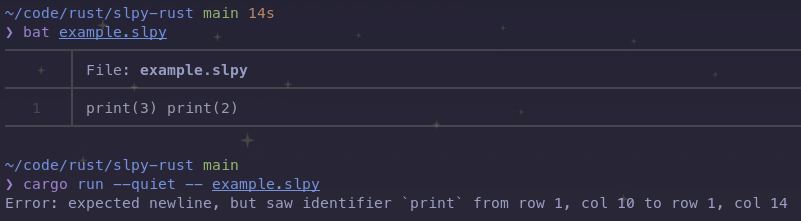

# CSCI 394: Homework 1

### Sima Nerush & Riley Shahar



For the first homework assignment, we rebuild the SLPY compiler using the
Rust programming language. Our implementation includes hand-built Lexer,
Parser, AST and Evaluator implementation. As a bonus feature, we have also
implemented a fully-working REPL.

To run the interpreter on a file, run `cargo run --quiet -- <PATH_TO_FILE>`

A link to our repository: https://github.com/simanerush/slpy-rust

## Homework exercises

### 2.2 `--dump`



To use, run

```
cargo run --quiet -- --dump <PATH_TO_FILE>
```

you should see the AST printed out.

### 2.3 `**`



### 2.4 `print` with multiple arguments



### 2.5 `+=` statement



## Bonus features

## REPL

Our implementation has a built-in REPL. To run it, execute `cargo run --quiet`
inside the `slpy-rust` folder.


## Unit tests

There is a full unit test suite for every stage of interpeting SLPY (Lexer,
Parser, AST and Evaluator). Run `cargo test` to see them run!

## Span tracking

Our implementation keeps the span for every token through the whole pipeline
of compilation. This allows for for better diagnostics, e.g.:


